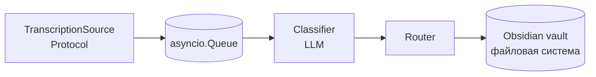

# transcript-router

Демо-проект: пайплайн автоматической маршрутизации голосовых транскрипций в knowledge base (Obsidian) с категоризацией через LLM. Показывает архитектуру и инженерную зрелость подхода, готов к разработке прод-версии под конкретного заказчика. Запускается локально одной командой на встроенных моках.

## Поток данных



Один процесс, один async-воркер, без HTTP-сервера. Любой реальный источник — webhook, поллер, разбор экспорта — подключается как ещё одна имплементация `TranscriptionSource`, ядро не меняется.

## Что реализовано

- `TranscriptionSource` как `Protocol` и `MockPlaudSource` с пятью репрезентативными сценариями (встреча, голосовая заметка-напоминание, инструкция, конспект разговора, личная мысль).
- `Classifier` с pydantic-моделью ответа (`category`, `confidence`, `suggested_title`, `key_points`, `tags`), доменными ошибками и структурированными логами.
- `Router`: запись `.md` в нужную папку vault, имя файла `slug(title)-YYYYMMDD`, YAML-frontmatter (`created`, `category`, `source`, `tags`).
- Sample vault с папками `00_Inbox`, `10_Meetings`, `20_Notes`, `30_Instructions`, `40_Other`.
- Конфиг через `pydantic-settings`, JSON-логи через `structlog`.
- Pytest-набор: source, classifier, router, end-to-end.
- Dockerfile и docker-compose для локального запуска.

## Что в scope продакшен-разработки

Это самая важная секция. Демо умышленно не покрывает следующее — оно требует обсуждения с заказчиком и оплачиваемой работы:

- **Реальный коннектор к Plaud.** В демо источник — мок. Конкретный механизм забора транскрипций (webhook от Plaud, поллинг экспортов, интеграция через их API) определяется на kick-off и реализуется как ещё одна имплементация `TranscriptionSource`.
- **Промпт-инжиниринг под домен заказчика.** В коде LLM-вызов замещён детерминированным стабом. Промпт, формат few-shot примеров, JSON-схема ответа, выбор модели и настройка температуры под реальные транскрипции — отдельный артефакт, разрабатываемый итеративно с заказчиком на его данных.
- **Таксономия категорий и шаблоны заметок.** В демо четыре generic-категории (`meeting`, `note`, `instruction`, `other`) и единый шаблон файла. Реальный набор категорий, маппинг на структуру vault и кастомные шаблоны под типы записей — результат kick-off-сессии.
- **Прод-обвязка.** Не реализовано: retry с экспоненциальным backoff на ошибках API, дедупликация транскрипций, обработка входа длиннее контекстного окна, graceful shutdown с дренированием очереди, dead-letter queue для непарсящихся ответов, лимиты конкурентности по rate-limit API.
- **Деплой и эксплуатация.** Не входит в демо: настройка VPS, CI/CD, secrets management, мониторинг (метрики/алерты), бэкапы vault, ротация логов. В `examples/transcript-router.service` лежит иллюстративный systemd unit — не готовое решение.
- **Пользовательская документация.** Инструкции для нетехнических сотрудников клиники (как класть транскрипции, как читать структуру vault, что делать при сбоях) — отдельный deliverable.
- **PII/комплаенс.** В медицинском контексте транскрипции могут содержать персональные данные пациентов. Хранение, передача в LLM-провайдера, журналирование — требуют отдельного обсуждения требований и, возможно, маскирования/локального инференса. В демо не реализовано.
- **Интеграция с Obsidian Sync.** Настройка синхронизации vault между устройствами и пользователями — на стороне клиента.

## Локальный запуск

```bash
pip install -e ".[dev]"
cp .env.example .env
python examples/run_demo.py
```

После прогона в `vault/` появятся пять `.md`-файлов в соответствующих папках. Логи — JSON в stdout.

Альтернативно — через Docker:

```bash
docker compose up --build
```

Тесты:

```bash
pytest
```

## Структура репозитория

```
src/transcript_router/
  models.py            # Transcription, Classification, Category
  config.py            # Settings (pydantic-settings)
  logging.py           # structlog JSON setup
  pipeline.py          # async producer/consumer на asyncio.Queue
  sources/             # Protocol + MockPlaudSource
  classifier/          # LLM-вызов (в демо — стаб)
  router/              # запись .md в vault

vault/                 # sample Obsidian vault
examples/
  run_demo.py          # единственная точка запуска (на моках)
  transcript-router.service  # иллюстрация systemd-юнита
tests/                 # pytest
```

## Технические решения

**Почему async-воркер, а не HTTP-сервер.** Источники транскрипций бывают и push (webhook), и pull (поллинг). Оба варианта чисто оборачиваются в `TranscriptionSource` и подаются в общий конвейер; HTTP-фасад в ядре только добавит уровень и привяжет реализацию к одному способу получения данных. Если у конкретного заказчика появится webhook — он реализуется как отдельный модуль, который пушит в тот же `asyncio.Queue` или сам становится источником.

**Почему `asyncio.Queue`, а не Redis/Celery.** Один процесс, один поток входных данных, объёмы, не требующие распределённой инфраструктуры. `asyncio.Queue` достаточен для нагрузки, ожидаемой от одной клиники. При росте масштаба слой очереди изолирован и заменяется без изменения остального кода.

**Почему модули нарезаны по домену (`sources/`, `classifier/`, `router/`).** Каждая папка — одна ответственность, видимая снаружи. Никаких `domain/`, `infrastructure/`, `application/` — для проекта в ~1000 строк это шум. Один `Protocol` для источников оправдан (mock vs реальные); больше абстракций не вводится без явной причины.

**Почему стаб вместо реального API-вызова в демо.** Промпт и схема ответа классификатора — основной артефакт настройки под клиента и предмет итеративной работы на kick-off. В демо они отсутствуют сознательно: интерфейс класса, парсинг, валидация и обработка ошибок реализованы полностью, заменён только сам сетевой вызов. Это позволяет показать архитектуру без раскрытия конкретных промптов и без зависимости от API-ключа.

## Контакт

Telegram: [@artyom_klyuk](https://t.me/artyom_klyuk)
